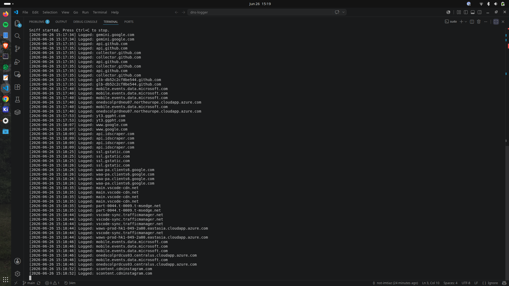

# Invisible Packet Logger

A lightweight, modular network utility designed to capture DNS queries on your home network and persist them to a local SQLite database.

# Overview
The Invisible Packet Logger acts as a passive network monitor. By intercepting UDP traffic on port 53, it extracts domain names from DNS queries in real-time, providing visibility into the web traffic originating from your network.

# How it Works
1. **Traffic Interception**: The tool uses `scapy` to sniff packets passing through your network interface[cite: 4].
2. **DNS Filtering**: It filters for UDP port 53 traffic, which is the standard protocol for DNS queries[cite: 4].
3. **Extraction**: The script parses the DNS Query Record (DNSQR) layer of the packet to retrieve the domain name[cite: 4, 5].
4. **Persistence**: Extracted domains, along with a timestamp, are saved to a local `dns_logs.db` file using SQLite[cite: 5].

# Prerequisites
* Python 3.x
* [Scapy](https://scapy.net/)
* Administrative/Root privileges (required for raw network sniffing)

# Installation
Clone the repository:

## Run this commands on terminal

git clone [https://github.com/yourusername/dns-logger.git](https://github.com/yourusername/dns-logger.git)

cd dns-logger

## Install Dependencies:

pip install -r requirements.txt

# Usage
Run the script with root/administrator privileges to allow packet capture:

sudo -E python3 main.py

# Disclaimer
This tool is intended for educational and authorized network monitoring purposes only. Ensure you have explicit permission before monitoring any network traffic.

# License
This project is licensed under the MIT License - see the LICENSE file for details.
